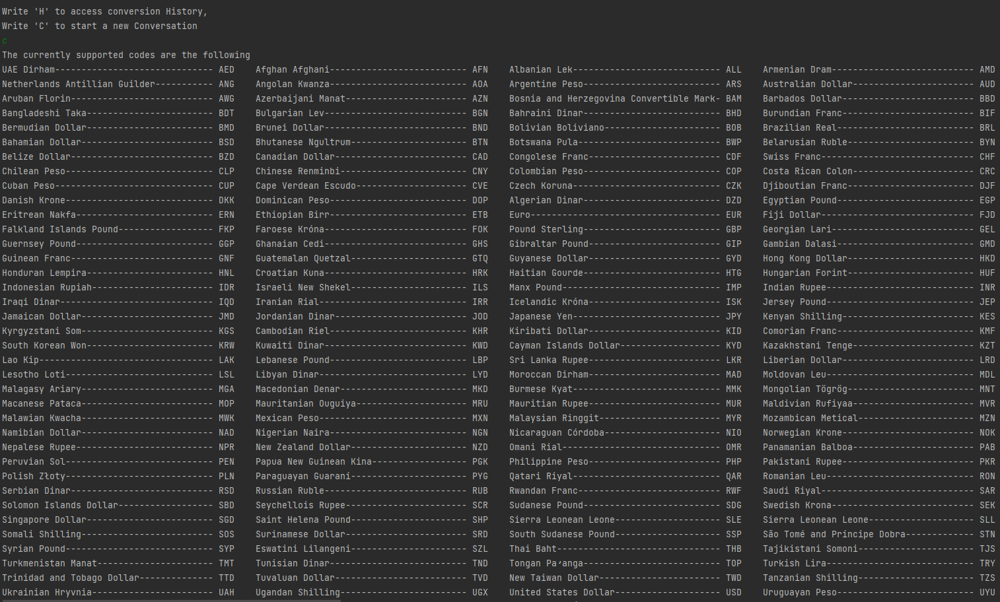
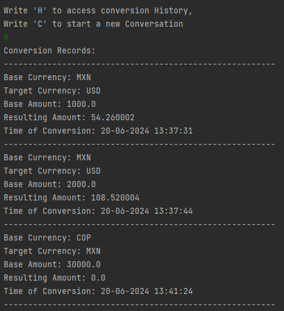
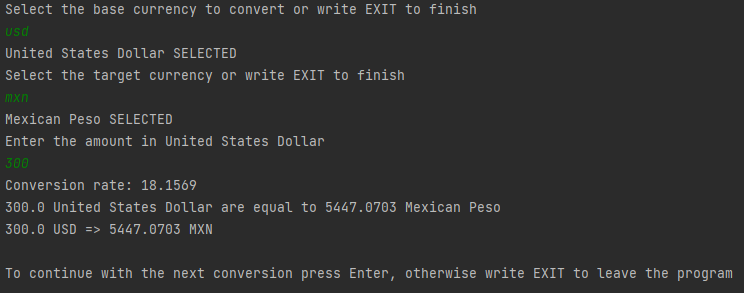
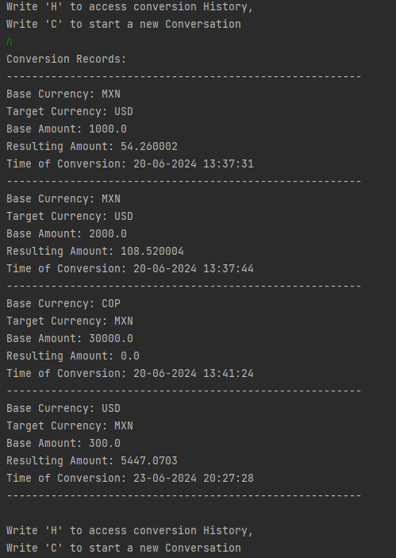

# Currency Converter Console Application

This is a Java console application that performs currency conversions using the [ExchangeRate-API](https://www.exchangerate-api.com/). It can convert between any supported currencies and store the history of conversions in a JSON file for later use.

## Features

- Fetches current exchange rates from the ExchangeRate-API.
- Converts amounts between any supported currencies.
- Stores conversion history in a JSON file.
- Loads conversion history from the JSON file on startup.

## Requirements

- Java 8 or higher
- [Gson](https://github.com/google/gson) library for JSON parsing
- An API key from [ExchangeRate-API](https://www.exchangerate-api.com/)

## Images

Here are some screenshots of the application in action:

1. **Supported codes listing**  

2. **Conversion History**  

3. **Currency Conversion**  

4. **Updated Conversion History**  

